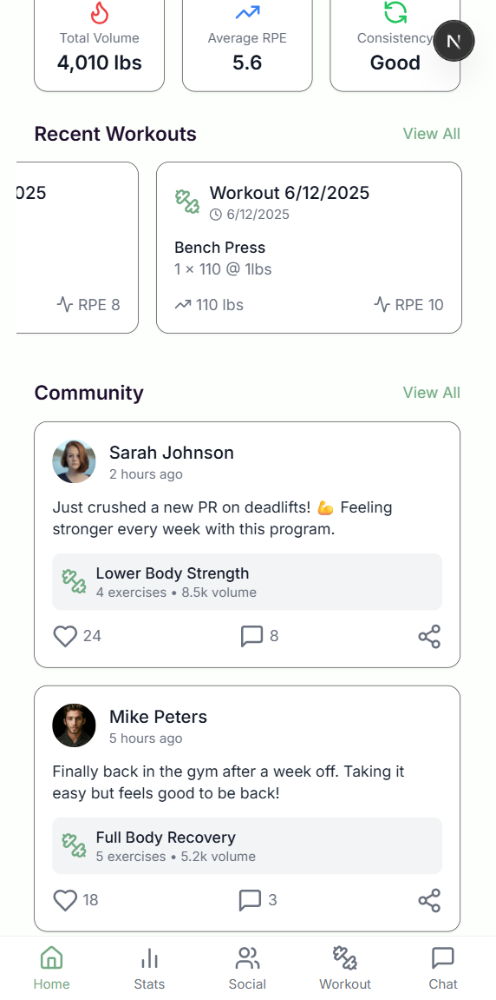
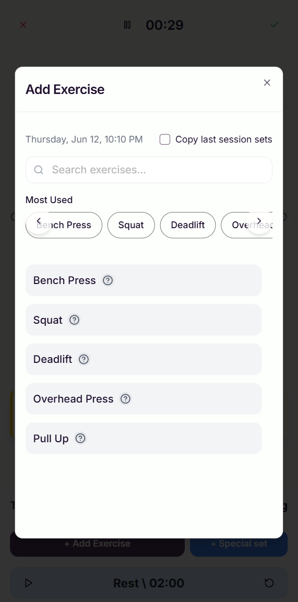
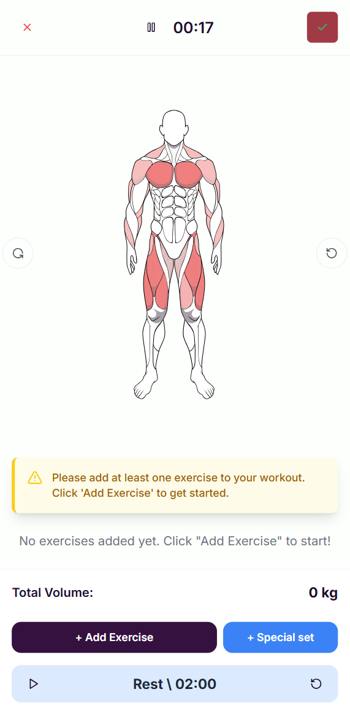
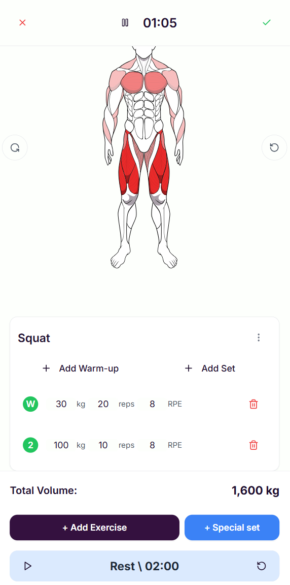
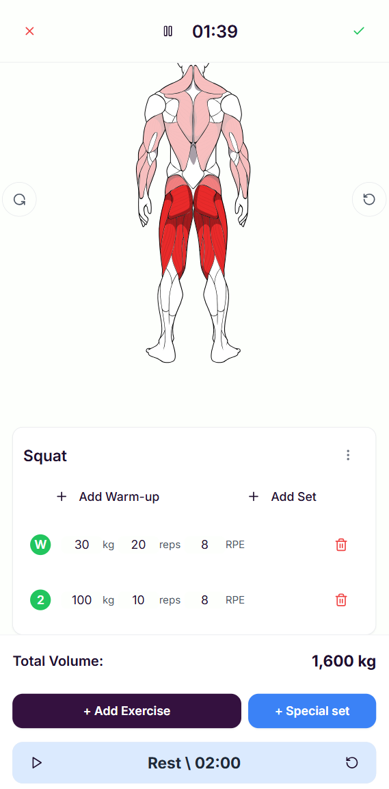
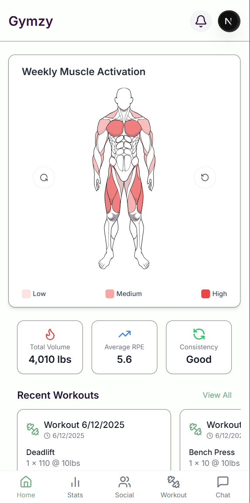
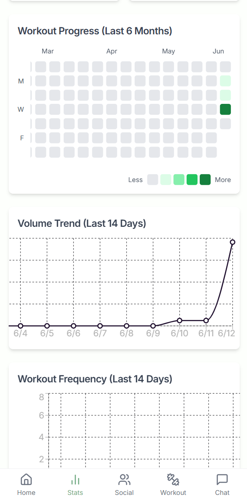
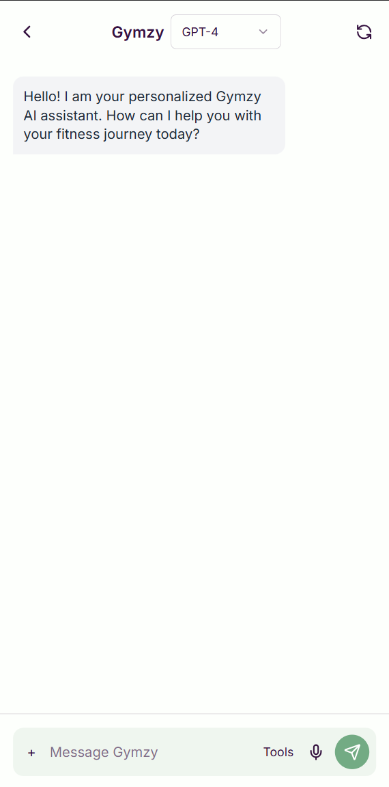
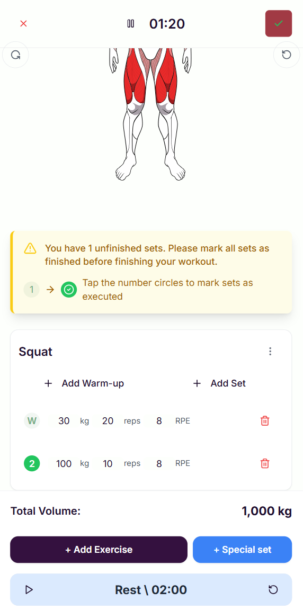
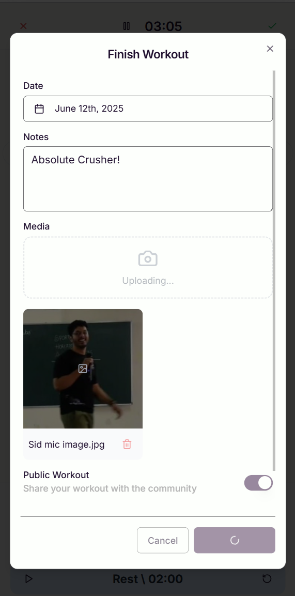

<div align="center">
  <h1>Gymzy</h1>
  <h3>Your AI-Powered Fitness Companion</h3>
  
  [](https://opensource.org/licenses/MIT)
  [](https://nextjs.org/)
  [](https://reactjs.org/)
  [](https://www.typescriptlang.org/)
  
  [](https://vercel.com/new/git/external?repository-url=https%3A%2F%2Fgithub.com%2Fyourusername%2Fgymzy)
  
  
</div>

## 🚀 Features

### 📊 Interactive Dashboard

- **At-a-Glance Stats**: View your weekly progress and upcoming workouts
- **Quick Actions**: Start a new workout or review your history instantly
- **Performance Overview**: Track your fitness journey with beautiful visualizations

### 🏋️‍♂️ Smart Workout Tracking
<div style="display: flex; flex-wrap: wrap; gap: 16px; margin: 20px 0;">
  
  
</div>
- **Effortless Exercise Logging**: Add exercises with just a few taps
- **Custom Workout Templates**: Save your favorite routines for quick access
- **Intuitive Interface**: Simple, clean design for distraction-free training

### 💪 Muscle Activation Visualization
<div style="display: flex; flex-wrap: wrap; gap: 16px; margin: 20px 0;">
  
  
</div>
- **Interactive Anatomy Models**: Switch between front and back views
- **Real-time Feedback**: See which muscles are being activated
- **Form Guidance**: Visual cues for proper exercise execution

### 📈 Comprehensive Analytics
<div style="display: flex; flex-wrap: wrap; gap: 16px; margin: 20px 0;">
  
  
</div>
- **Weekly Muscle Activation**: Track which muscle groups you've worked
- **Training Volume Analysis**: Monitor your progress over time
- **Performance Insights**: Get personalized recommendations

### 🤖 AI-Powered Assistance
<div style="display: flex; flex-wrap: wrap; gap: 16px; margin: 20px 0;">
  
</div>
- **24/7 Support**: Get instant answers to your fitness questions
- **Personalized Advice**: Receive workout and nutrition recommendations
- **Form Checks**: Get feedback on your exercise technique

### 🚨 Smart Notifications
<div style="display: flex; flex-wrap: wrap; gap: 16px; margin: 20px 0;">
  
  
</div>
- **Set Completion Reminders**: Never forget to finish your planned sets
- **Workout Summary**: Review your completed workout volume and stats
- **Rest Day Alerts**: Optimize recovery with smart notifications

## 🛠️ Tech Stack

### Frontend
- **Framework**: Next.js 15.2.3 with App Router
- **UI Library**: React 18.3.1
- **Styling**: Tailwind CSS with CSS Modules
- **State Management**: React Context + Zustand
- **Form Handling**: React Hook Form + Zod
- **Data Visualization**: Recharts
- **UI Components**: shadcn/ui + Radix UI

### Backend
- **Authentication**: Firebase Auth
- **Database**: Firestore
- **Storage**: Firebase Storage
- **Hosting**: Vercel

## 🚀 Getting Started

### Prerequisites
- Node.js 18.x or later
- npm 9.x or later / yarn 1.22.x or later
- Firebase account (for authentication and database)

### Local Development

1. **Clone the repository**
   ```bash
   git clone https://github.com/yourusername/gymzy.git
   cd gymzy
   ```

2. **Install dependencies**
   ```bash
   npm install
   # or
   yarn
   ```

3. **Set up environment variables**
   - Copy `.env.example` to `.env.local`
   - Update with your Firebase project credentials
   ```bash
   cp .env.example .env.local
   ```

4. **Start the development server**
   ```bash
   npm run dev
   # or
   yarn dev
   ```
   The application will be available at [http://localhost:9002](http://localhost:9002)

## 🤝 Contributing

We welcome contributions! Please see our [Contributing Guidelines](CONTRIBUTING.md) for details on how to get started.

## 📄 License

This project is licensed under the MIT License - see the [LICENSE](LICENSE) file for details.

## ✨ Show Your Support

Give a ⭐️ if this project helped you!

---

<div align="center">
  Made with ❤️ by the Gymzy Team
</div>

## 📄 License

This project is licensed under the MIT License - see the [LICENSE](LICENSE) file for details.

## 🙏 Acknowledgments

- SVG anatomy illustrations
- Radix UI for accessible components
- Next.js team for the amazing framework

## 📞 Contact

For support or queries, please open an issue in the repository or contact us at dorddis2@gmail.com

---

Made with ❤️ by the Gymzy Team
