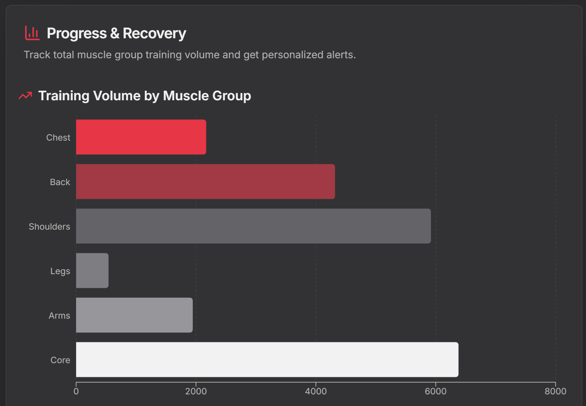

# Gymzy - Your Smart Fitness Partner [[OLD]] (work in progress for new UI/UX)


Gymzy is an innovative fitness application that combines interactive anatomy visualization, smart workout logging, and comprehensive progress analytics to help users train more effectively.

## 🌟 Features

### Interactive Anatomy Visualization

- Interactive 2D front and back anatomical views
- Color-coded muscle activation tracking
- Real-time visual feedback
- Intuitive muscle selection
- Easy switching between front and back views

### Smart Workout Logging

- Comprehensive exercise tracking
- Biomechanical muscle mapping
- Real-time muscle activation feedback
- Custom workout creation

### Progress Analytics

- Training volume tracking
- Muscle-specific progress visualization
- Recovery and overuse detection
- Performance insights

## 🛠️ Tech Stack

- **Frontend**: Next.js 15.2.3, React 18.3.1
- **Styling**: Tailwind CSS
- **Visualization**: SVG-based 2D anatomy views
- **State Management**: React Context
- **UI Components**: Radix UI
- **Data Visualization**: Recharts
- **Form Handling**: React Hook Form, Zod
- **Backend**: Firebase

## 🚀 Getting Started

### Prerequisites
- Node.js 18.x or later
- npm or yarn

### Installation

1. Clone the repository:
```bash
git clone https://github.com/yourusername/gymzy.git
cd gymzy
```

2. Install dependencies:
```bash
npm install
# or
yarn install
```

3. Set up environment variables:
```bash
cp .env.example .env.local
```

4. Start the development server:
```bash
npm run dev
# or
yarn dev
```

The application will be available at `http://localhost:9002`

## 📱 Features in Detail

### Interactive Anatomy Visualization
- Switch between front and back anatomical views
- Click on muscles to see detailed information
- Track muscle activation through color gradients
- View muscle groups and their relationships
- Responsive design for all screen sizes

### Smart Workout Logging
- Log exercises with sets, reps, and weights
- Automatic muscle activation mapping
- Real-time visual feedback
- Custom workout creation and templates

### Progress Analytics
- Track training volume over time
- View muscle-specific progress
- Monitor recovery patterns
- Get personalized insights

## 🤝 Contributing

We welcome contributions! Please see our [Contributing Guidelines](CONTRIBUTING.md) for details.

## 📄 License

This project is licensed under the MIT License - see the [LICENSE](LICENSE) file for details.

## 🙏 Acknowledgments

- SVG anatomy illustrations
- Radix UI for accessible components
- Next.js team for the amazing framework

## 📞 Contact

For support or queries, please open an issue in the repository or contact us at dorddis2@gmail.com

---

Made with ❤️ by the Gymzy Team
