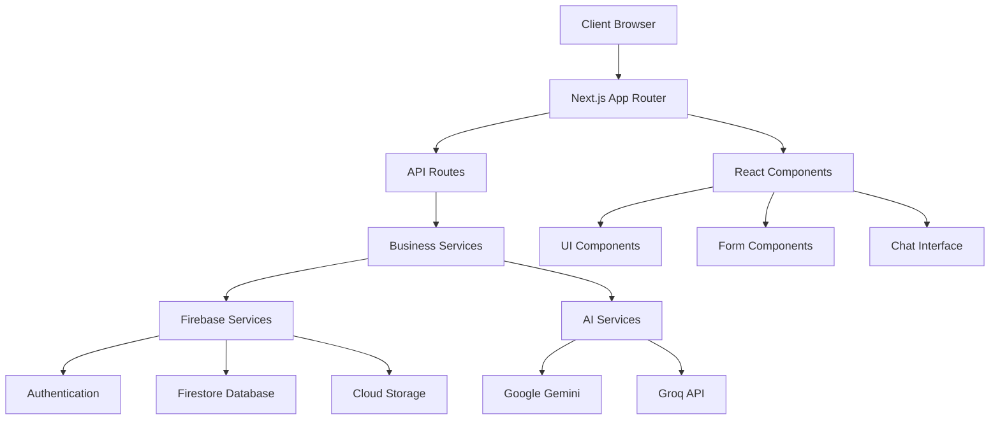

# 🏗️ Gymzy Architecture Overview

## System Architecture

Gymzy is built as a modern, scalable fitness application using Next.js 14 with the App Router, TypeScript, and Firebase. The architecture follows clean architecture principles with clear separation of concerns.

## High-Level Architecture



## Core Technologies

### Frontend Stack
- **Next.js 14** - React framework with App Router
- **TypeScript** - Type-safe JavaScript
- **Tailwind CSS** - Utility-first CSS framework
- **Shadcn/ui** - Component library
- **React Hook Form** - Form management
- **Zod** - Schema validation

### Backend Stack
- **Next.js API Routes** - Server-side API endpoints
- **Firebase** - Backend-as-a-Service
  - Authentication
  - Firestore (NoSQL database)
  - Cloud Storage
- **Vercel** - Deployment platform

### AI & ML
- **Google Gemini** - Primary AI model for chat
- **Groq** - High-performance AI for complex tasks
- **Custom AI Router** - Intelligent model selection

## Directory Structure & Responsibilities

### `/src/app/` - Next.js App Router
```
app/
├── api/                    # API routes
│   └── internal/          # Secure internal APIs
├── auth/                  # Authentication pages
├── dashboard/             # Main dashboard
├── workout/               # Workout-related pages
├── profile/               # User profile pages
├── layout.tsx             # Root layout
└── page.tsx               # Home page
```

### `/src/services/` - Business Logic Layer
```
services/
├── core/                  # Core business logic
│   ├── ai-chat-service.ts        # Chat functionality
│   ├── workout-service.ts        # Workout management
│   ├── user-discovery-service.ts # User discovery
│   └── unified-user-profile-service.ts # User profiles
├── ai/                    # AI-related services
│   ├── production-agentic-ai.ts  # Main AI service
│   ├── ai-workout-tools.ts       # Workout generation
│   ├── groq-service.ts           # Groq integration
│   └── intelligent-agent-service.ts # AI agent
├── data/                  # Data management
│   ├── contextual-data-service.ts # Context management
│   ├── onboarding-context-service.ts # Onboarding
│   └── chat-history-service.ts   # Chat persistence
├── media/                 # Media handling
│   ├── media-service.ts          # File uploads
│   └── profile-picture-service.ts # Profile images
├── social/                # Social features
│   ├── social-feed-service.ts    # Social feed
│   ├── workout-sharing-service.ts # Workout sharing
│   └── notification-service.ts   # Notifications
└── infrastructure/        # Supporting services
    ├── agentic-state-manager.ts  # State management
    ├── firebase-state-adapter.ts # Firebase integration
    └── robust-tool-executor.ts   # Tool execution
```

### `/src/lib/` - Utility Libraries
```
lib/
├── validation/            # Input validation
│   ├── user-schemas.ts           # User validation
│   ├── workout-schemas.ts        # Workout validation
│   ├── chat-schemas.ts           # Chat validation
│   └── index.ts                  # Validation utilities
├── firebase.ts            # Firebase configuration
├── logger.ts              # Logging service
├── secure-ai-client.ts    # AI client
└── env-config.ts          # Environment validation
```

### `/src/types/` - Type Definitions
```
types/
├── chat.ts                # Chat-related types
├── workout.ts             # Workout-related types
├── user.ts                # User-related types
├── api.ts                 # API types
├── common.ts              # Common utility types
└── index.ts               # Type exports
```

## Data Flow Architecture

### 1. Request Flow
```
User Action → Component → Service → API Route → External Service → Database
```

### 2. AI Chat Flow
```
User Message → Chat Component → AI Chat Service → Secure AI Client → API Route → AI Provider → Response
```

### 3. Workout Creation Flow
```
User Input → Form Component → Validation → Workout Service → Firebase → Database
```

## Security Architecture

### API Security
- **Server-side API routes** - All external API calls happen server-side
- **Environment variable validation** - Zod schemas validate all env vars
- **Input validation** - All user inputs validated with Zod schemas
- **Rate limiting** - Built into API routes
- **Error boundaries** - Prevent app crashes from component errors

### Authentication Flow
```
User Login → Firebase Auth → JWT Token → Protected Routes → User Session
```

### Data Security
- **Firebase Security Rules** - Database-level security
- **Input sanitization** - All inputs validated and sanitized
- **Secure file uploads** - Validated file types and sizes
- **HTTPS only** - All communications encrypted

## State Management

### Client State
- **React State** - Component-level state
- **React Context** - Shared state (auth, chat)
- **Local Storage** - Persistent client state

### Server State
- **Firebase Firestore** - Primary database
- **Real-time subscriptions** - Live data updates
- **Optimistic updates** - Better UX

### AI State
- **Conversation context** - Maintained across sessions
- **User preferences** - Personalization data
- **Model selection** - Intelligent routing

## Performance Architecture

### Frontend Performance
- **Code splitting** - Dynamic imports for large components
- **Image optimization** - Next.js Image component
- **Bundle optimization** - Tree shaking and minification
- **Caching strategies** - Static and dynamic caching

### Backend Performance
- **API route optimization** - Efficient database queries
- **Connection pooling** - Firebase connection management
- **Response caching** - Cache frequently accessed data
- **Lazy loading** - Load data as needed

### AI Performance
- **Model selection** - Choose optimal model for task
- **Response streaming** - Stream AI responses for better UX
- **Context optimization** - Efficient context management
- **Caching** - Cache AI responses where appropriate

## Error Handling Architecture

### Error Boundaries
```
App Error Boundary (Root)
├── Feature Error Boundary (Feature Level)
└── Component Error Boundary (Component Level)
```

### Error Types
- **Validation Errors** - User input validation
- **Network Errors** - API and network failures
- **Authentication Errors** - Auth-related issues
- **AI Errors** - AI service failures
- **Database Errors** - Firebase operation failures

### Error Recovery
- **Retry mechanisms** - Automatic retry for transient failures
- **Fallback UI** - Graceful degradation
- **Error reporting** - Structured error logging
- **User feedback** - Clear error messages

## Deployment Architecture

### Development Environment
- **Local development** - Next.js dev server
- **Hot reloading** - Instant code updates
- **Mock services** - Testing without external dependencies

### Staging Environment
- **Vercel preview** - Automatic preview deployments
- **Firebase staging** - Separate Firebase project
- **End-to-end testing** - Full application testing

### Production Environment
- **Vercel production** - Optimized production build
- **Firebase production** - Production Firebase project
- **Monitoring** - Error tracking and performance monitoring
- **CDN** - Global content delivery

## Scalability Considerations

### Horizontal Scaling
- **Serverless functions** - Auto-scaling API routes
- **Firebase scaling** - Automatic database scaling
- **CDN distribution** - Global content delivery

### Vertical Scaling
- **Code optimization** - Efficient algorithms and data structures
- **Database optimization** - Efficient queries and indexes
- **Caching strategies** - Reduce database load

### Future Scaling
- **Microservices** - Service decomposition for large scale
- **Database sharding** - Horizontal database scaling
- **Load balancing** - Distribute traffic across instances

## Development Principles

### Clean Architecture
- **Separation of concerns** - Clear layer boundaries
- **Dependency inversion** - Depend on abstractions
- **Single responsibility** - Each module has one purpose

### Type Safety
- **TypeScript strict mode** - Maximum type safety
- **Zod validation** - Runtime type validation
- **Shared types** - Consistent types across layers

### Testing Strategy
- **Unit tests** - Test individual functions and components
- **Integration tests** - Test service interactions
- **End-to-end tests** - Test complete user flows

### Code Quality
- **ESLint** - Code linting and formatting
- **Prettier** - Code formatting
- **Husky** - Git hooks for quality checks
- **TypeScript** - Static type checking
